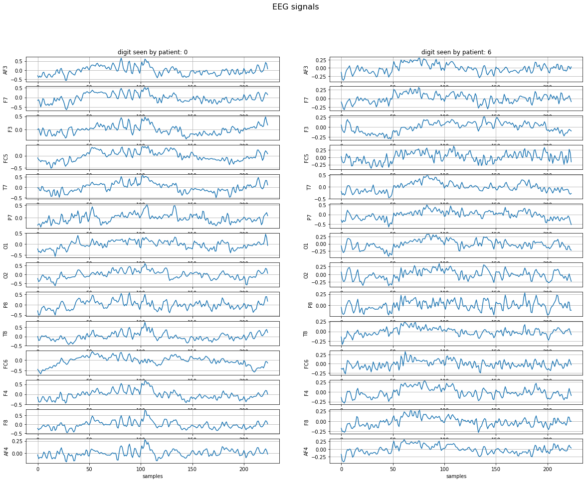
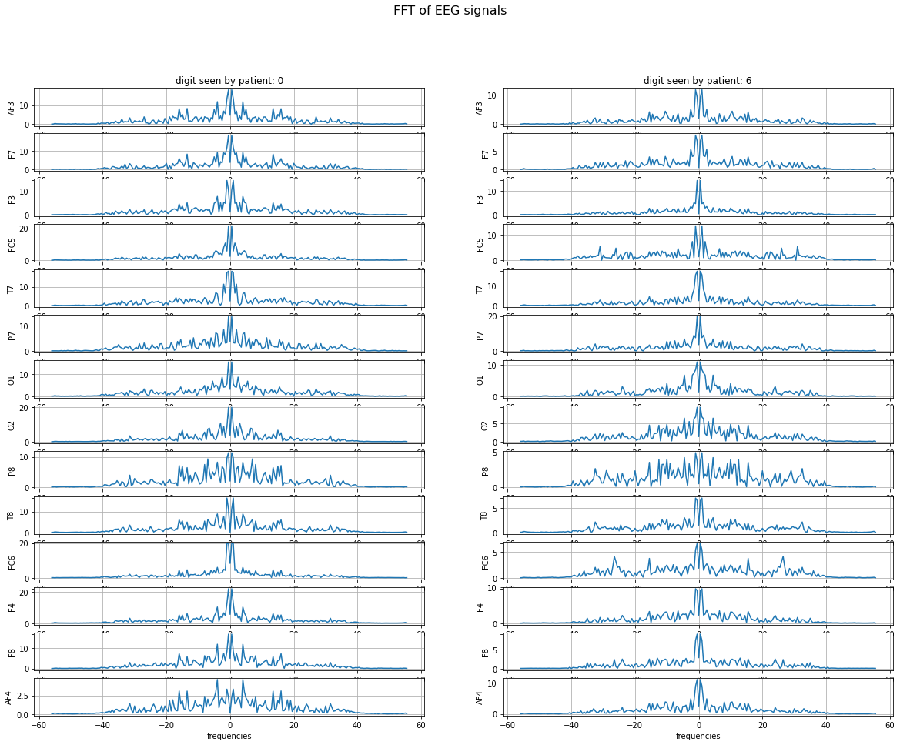
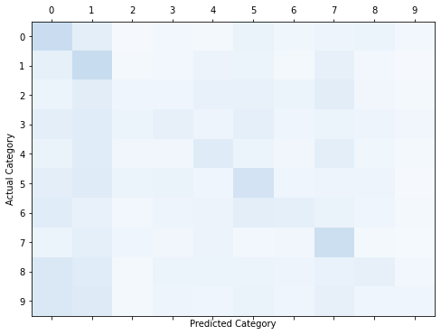

# EEG Classification of Visually-Evoked Stimuli Using CNNs

This project implements a Convolutional Neural Network (CNN) to classify EEG signals recorded while participants viewed digits from 0 to 9. Leveraging the MindBigData dataset, this model analyzes visually-evoked EEG signals to identify the digit being viewed.

## Project Overview

Human vision plays a vital role in interpreting visual stimuli, generating distinct brain signals that can be detected via EEG. By leveraging CNNs, we can automate feature extraction to classify these signals with higher accuracy. This project explores CNN-based classification of EEG signals, identifying which digit the subject was viewing during EEG recording.

## Dataset Acquisition

The MindBigData dataset serves as the foundation for this project, containing over a million 2-second EEG recordings associated with digit stimuli:
- **Sample Rate**: 128 Hz, yielding 256 data points for each 2-second signal.
- **EEG Channels**: 14 channels capturing data from various brain regions.
- **Dataset Size**: This project uses 6,500 samples per digit, resulting in a total of 65,000 samples.
- **Data Split**: 75% for training, 15% for validation, and 10% for testing.

## Data Preprocessing

EEG signals undergo preprocessing to ensure clarity and noise reduction, enhancing model performance:
- **Bandpass Filtering**: Removes noise between 0.5–63 Hz.
- **Notch Filtering**: Reduces 50 Hz powerline noise.
- **Normalization and Scaling**: Standardizes each EEG channel.
- **Signal Trimming**: Focuses on key signal segments for improved learning.

## Model Architecture

The CNN architecture consists of five convolutional layers and fully connected layers designed to extract spectral, spatial, and temporal features:
1. **Spectral Feature Extraction**: The first two layers process individual EEG channels, extracting time-based features.
2. **Spatial Filtering**: The third layer captures cross-channel relationships.
3. **Temporal Pattern Analysis**: The last two layers detect temporal patterns in the feature maps.
4. **Regularization with Dropout**: Dropout layers (0.5) after the third and fifth layers help mitigate overfitting.

**Architecture Overview**:
- **Input**: Preprocessed 14-channel EEG signals with 224 time samples per channel.
- **Convolutional Layers**: Five layers using ELU activation and batch normalization.
- **Fully Connected Layers**: Two layers for classification, with the final output representing the 10-digit classes (0–9).

## Results

The model was trained for 200 epochs. Key results include:
- **Test Accuracy**: 21.5% on the test set, indicating the model’s ability to classify visually-evoked EEG signals.
- **Loss and Accuracy Graphs**: These charts depict the model’s convergence over training epochs.

### Sample Plots

Below are examples of signal processing and classification results:

#### EEG Signals Plot
Each EEG channel is plotted with corresponding time series data.

#### FFT of EEG Signals
The Fast Fourier Transform (FFT) visualizes the frequency components of each EEG channel.

#### Confusion Matrix
The confusion matrix shows model accuracy across the 10 classes.

## Files in the Repository

- `EEGClassification.py`: Main code file for data loading, preprocessing, and model training.
- `utils.py`: Contains helper functions for dataset download and data processing.
- `images/`: Directory containing visual assets for use in this README.

## How to Run

1. **Download Dataset**: Use `DownloadDataSet()` function to download and extract the dataset.
2. **Preprocess Data**: Run `PreProcess()` to apply filtering and normalization on EEG signals.
3. **Train the Model**: Call `compile_model()` to train the CNN model and track metrics.
4. **Evaluate Model**: Evaluate the model on the test set to generate accuracy and the confusion matrix.

